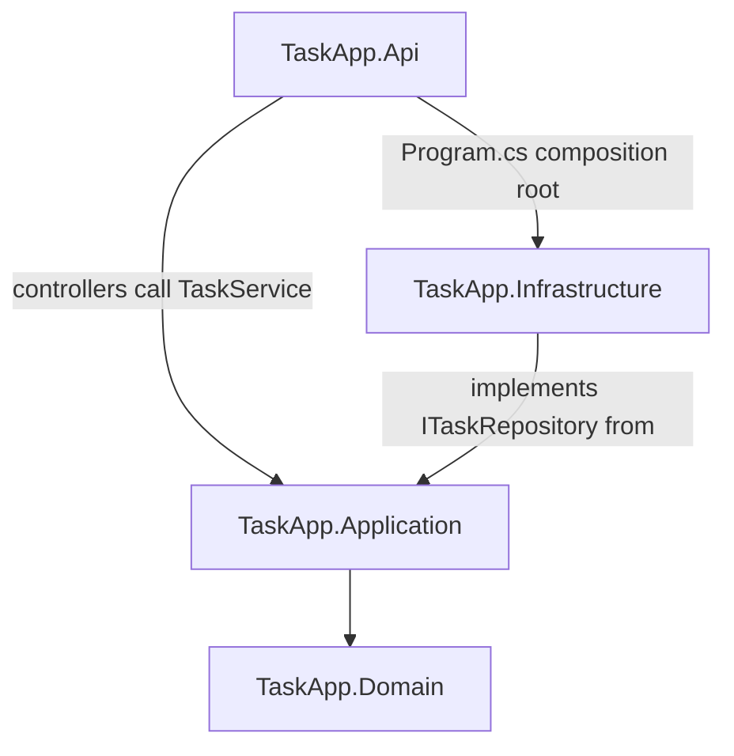
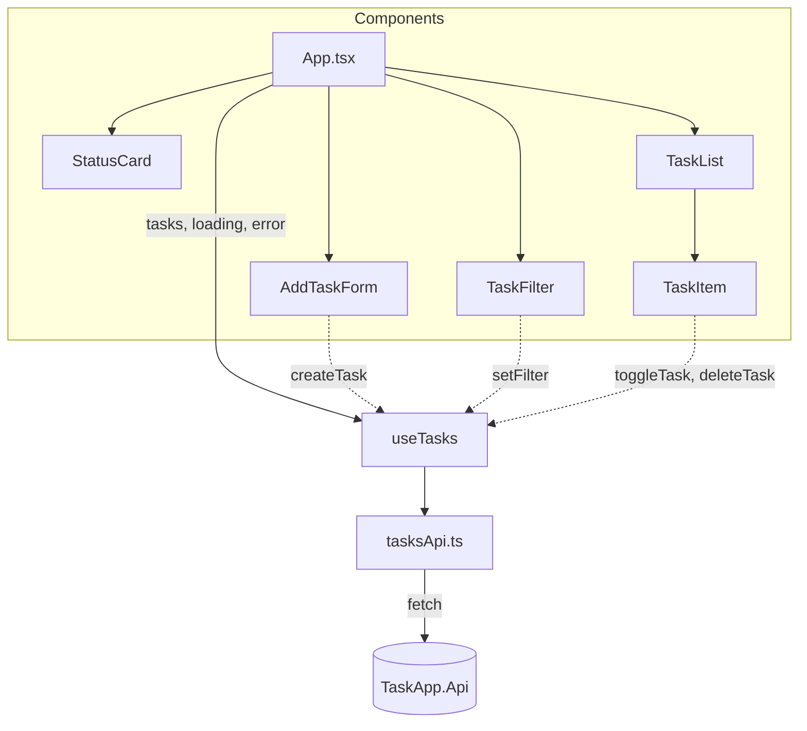
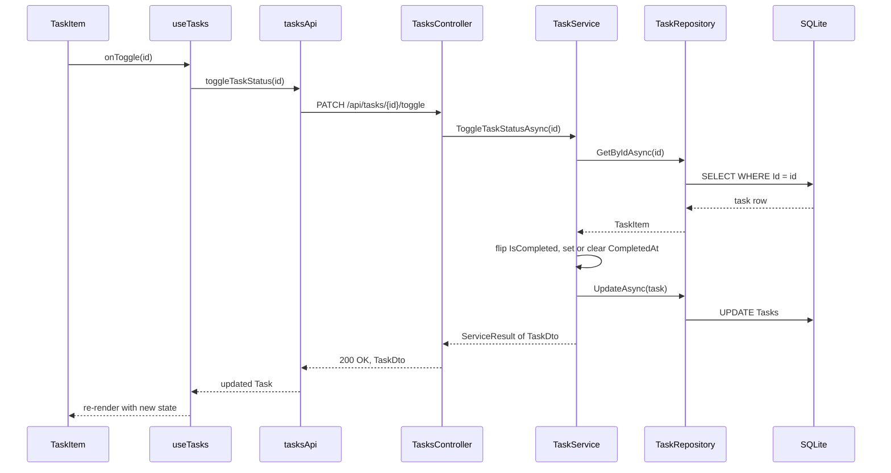
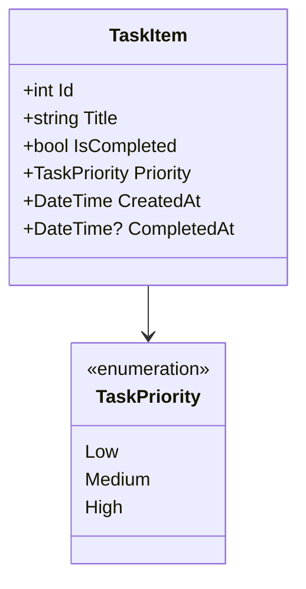
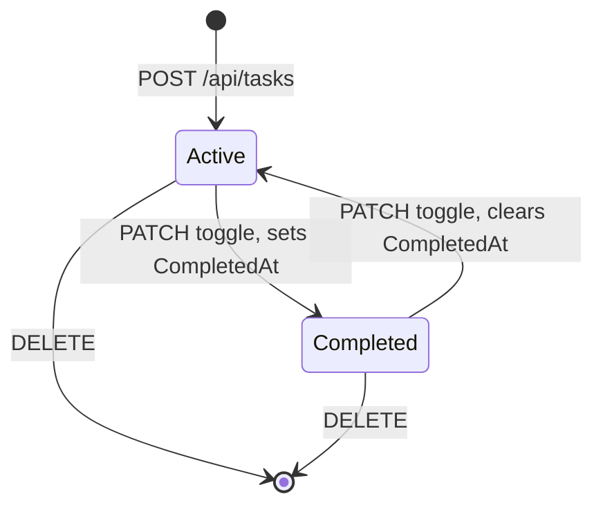
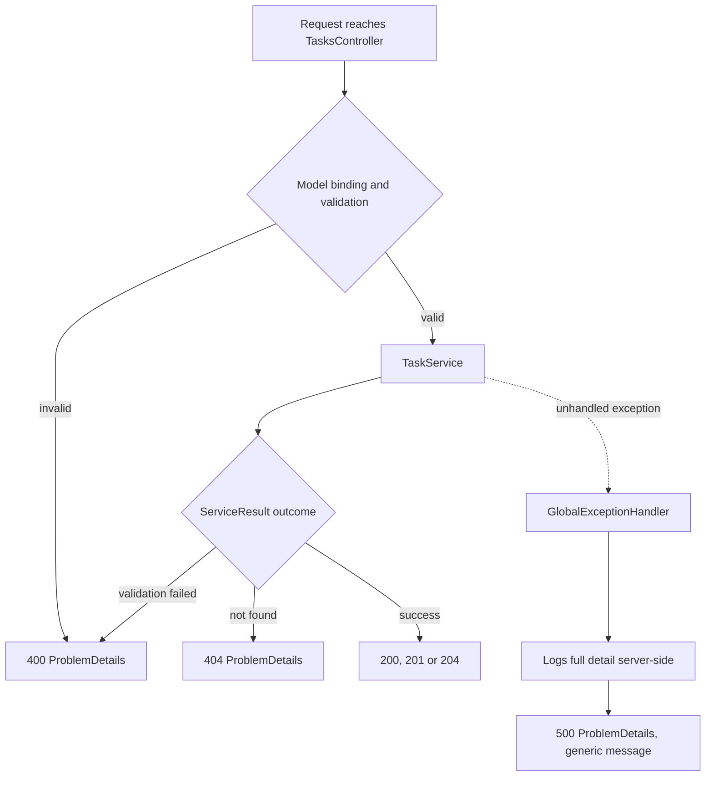

# Task Management App

A task management REST API and web client built for the Lateral Group take-home assessment. Backend on .NET 10 with EF Core and SQLite, frontend on React and TypeScript, both organized around a Clean Architecture backend and a component-based, hook-driven frontend.

## Tech stack

**Backend:** .NET 10, ASP.NET Core, Entity Framework Core, SQLite, FluentValidation, Swashbuckle (Swagger UI)

**Frontend:** React 19, TypeScript, Vite, Tailwind CSS

**Testing:** xUnit, Moq

## Getting started

### Prerequisites

- .NET 10 SDK
- Node.js 20 or later

### Backend

```bash
cd backend/src/TaskApp.Api
dotnet run
```

The API listens on `http://localhost:5211`. On first run it applies the EF Core migration to create the SQLite database (`taskapp.db`, in the same folder) and seeds four example tasks with varied priorities and statuses, so the list is populated immediately. The seed only runs when the table is empty, so restarting the app does not duplicate data.

Swagger UI: `http://localhost:5211/swagger`

### Frontend

```bash
cd frontend
npm install
npm run dev
```

The app runs on `http://localhost:5173` and expects the API at `http://localhost:5211` (see `frontend/src/api/tasksApi.ts` if the backend runs elsewhere).

### Tests

```bash
cd backend
dotnet test
```

## Project structure

```
lateral-task-app/
├── backend/
│   ├── src/
│   │   ├── TaskApp.Domain/          entity and enum, no dependencies on other layers
│   │   ├── TaskApp.Application/     services, DTOs, interfaces, validators
│   │   ├── TaskApp.Infrastructure/  EF Core, SQLite, repository implementation
│   │   └── TaskApp.Api/             controllers, middleware, composition root
│   └── tests/
│       └── TaskApp.Tests/           xUnit tests for the Application layer
├── frontend/
│   └── src/
│       ├── api/          tasksApi.ts: the only module that calls fetch
│       ├── components/   AddTaskForm, TaskFilter, TaskItem, TaskList, StatusCard
│       ├── constants/    priority.ts: label, color, and display order per priority
│       ├── hooks/        useTasks.ts: task state and API orchestration
│       └── types/        task.ts: types mirroring the backend DTOs
└── README.md
```

## Architecture

### Layers and dependency direction

`TaskApp.Api` and `TaskApp.Infrastructure` depend on `TaskApp.Application`. `TaskApp.Application` depends on `TaskApp.Domain`. `TaskApp.Domain` depends on nothing. `TaskApp.Api` also references `TaskApp.Infrastructure`, but only to wire it up in `Program.cs`, the composition root: controllers call `TaskService`, which depends on `ITaskRepository`, never on the concrete EF Core repository.



### Frontend data flow

Components stay presentation-only. `useTasks` is the single owner of task state and the only caller of `tasksApi.ts`, which is in turn the only module that calls `fetch`.



### Request flow: toggling a task

End to end path for `PATCH /api/tasks/{id}/toggle`, from the checkbox click to the database and back.



### Data model



### Task lifecycle



## API reference

| Method | Route | Purpose | Body | Response |
|---|---|---|---|---|
| GET | `/api/tasks?status={All\|Active\|Completed}` | List tasks, optional status filter (defaults to All) | none | 200, `TaskDto[]` |
| POST | `/api/tasks` | Create a task | `{ title, priority }` | 201, `TaskDto` |
| PATCH | `/api/tasks/{id}/toggle` | Toggle completed status | none | 200, `TaskDto`; 404 if missing |
| DELETE | `/api/tasks/{id}` | Delete a task | none | 204; 404 if missing |

All error responses use RFC 7807 ProblemDetails.

## Design decisions

**Clean Architecture with four projects.** For an app this size, a single project with folders would be enough on its own merits. The layered structure is here to show how I organize a system meant to grow past a take-home, kept proportional to the scope: four small projects, not ten, no extra abstraction layers inside them.

**Dependency Inversion in practice.** `ITaskRepository` is declared in `TaskApp.Application`. `TaskRepository` implements it in `TaskApp.Infrastructure`. `TaskService` and `TasksController` depend on the interface, never on the EF Core class. The concrete implementation is registered in `TaskApp.Infrastructure.DependencyInjection.AddInfrastructure`, called once from `Program.cs`. Swapping SQLite for another provider means changing that one method, not the service or the controller.

**SOLID, mapped to real classes.** Single Responsibility: `TaskService` owns task business logic, `TaskRepository` owns persistence, `TasksController` owns HTTP concerns, each has one reason to change. Open/Closed: new behavior over `ITaskRepository` (a caching decorator, for example) can be added without touching `TaskService`. Liskov Substitution: any `ITaskRepository` implementation, the real one or a test double, is interchangeable without breaking callers. Interface Segregation: `ITaskRepository` exposes exactly the five operations tasks need, nothing broader. Dependency Inversion: as described above.

**Repository pattern.** `ITaskRepository` abstracts persistence behind five methods (`GetAllAsync`, `GetByIdAsync`, `AddAsync`, `UpdateAsync`, `DeleteAsync`). It lets `TaskService` be unit tested against a mock, with zero database involved, and keeps EF Core specifics (`AsNoTracking`, change tracking, `SaveChangesAsync`) out of the business logic.

**SQLite instead of a full database engine.** Whoever reviews this only needs the .NET SDK, no external database server, no connection string to configure. Because persistence sits behind `ITaskRepository`, moving to SQL Server or PostgreSQL in production is a configuration and package change in `TaskApp.Infrastructure`, not a rewrite of the service or API layer.

**DTOs, never entities, over the wire.** `TaskDto` and `CreateTaskDto` are the only types that cross the API boundary. `TaskMappingExtensions.ToDto()` does the entity-to-DTO mapping by hand rather than through a mapping library: with one DTO and a handful of fields, a manual mapping method gives compile-time safety and costs nothing, where a mapping library would add a dependency and a runtime cost to solve a problem this project does not have.

**Centralized error handling with ProblemDetails.** `GlobalExceptionHandler` (`IExceptionHandler`) is the single place that catches whatever escapes a controller action: it logs the exception with full detail server-side and returns a generic 500 ProblemDetails body, never the exception message itself. Expected failures (validation, not found) never reach it: `TaskService` returns a `ServiceResult` or `ServiceResult<T>` describing the outcome, and `TasksController` maps that outcome to the matching status code (400 through automatic model validation, 404 through `Problem()`). One handler for the unexpected case, explicit mapping for the expected ones, no scattered try/catch blocks.



**Validation separated from business logic.** `CreateTaskDtoValidator` (FluentValidation) owns the rules: title required, 200 characters max, priority one of the known enum values. `TaskService.CreateTaskAsync` calls the validator and short-circuits on failure without touching the repository. The rule set can change without touching the service, and the service's job stays "orchestrate creation," not "know what makes a title valid."

**Idempotent seed.** `DbSeeder.SeedAsync` applies pending migrations, then checks whether the `Tasks` table already has rows before inserting the four example tasks. Restarting the app never duplicates the seed data.

**Frontend structure mirrors the backend's separation of concerns.** Components render, `useTasks` owns state and orchestrates calls, `tasksApi.ts` is the only module that touches `fetch`. TypeScript types in `types/task.ts` mirror the backend DTOs field for field, so a shape mismatch shows up as a type error, not a runtime surprise. Loading, error, and empty states are explicit branches in `App.tsx`, not implicit gaps.

**Client-side filtering on the frontend.** The backend's `status` query parameter is fully implemented and tested (`TaskService.GetTasksAsync`), but `useTasks` fetches the full list once and filters it in memory, switching between All, Active, and Completed instantly with no network round trip and no loading flash. The parameter still makes the endpoint a correct, complete contract on its own: a different consumer of this API would filter server-side by passing `status`, this particular frontend just chooses not to, for a snappier UX. It also makes the remaining-count in the header a simple derived value instead of a second request. At a much larger task volume this would move back to server-side filtering with pagination.

**Logging goes to stdout via the built-in ILogger rather than to a local file.** This follows twelve-factor practice: the application emits an event stream and the hosting environment handles collection and routing. In production this would flow into a centralized platform (Datadog, Application Insights, CloudWatch), where local files would be lost on container restart anyway.

## Testing strategy

Tests target the Application layer, specifically `TaskService`, because that is where the behavior and the risk live: validation rules, status transitions, filtering, and not-found handling. `ITaskRepository` is mocked with Moq; `CreateTaskDtoValidator` runs for real in the create tests, so those tests exercise the actual validation rules rather than a stand-in for them.

Naming follows `Method_Scenario_ExpectedResult`. All eight tests live in `TaskApp.Tests/Services/TaskServiceTests.cs`:

- `GetTasks_WithStatusFilter_ReturnsOnlyMatchingTasks`: a mixed set of active and completed tasks, filtered by All, Active, and Completed, returns only the matching subset each time.
- `CreateTask_WithValidData_ReturnsCreatedTask`: valid input returns a `TaskDto` with the assigned id, the given title and priority, `IsCompleted` false, and a recent `CreatedAt`.
- `CreateTask_WithEmptyTitle_FailsValidation`: an empty title fails validation and the repository is never called.
- `CreateTask_WithTitleExceedingMaxLength_FailsValidation`: a 201-character title fails validation and the repository is never called.
- `ToggleStatus_WhenTaskExists_FlipsIsCompletedAndSetsCompletedAt`: toggling an active task sets `IsCompleted` and `CompletedAt`; toggling it again clears both.
- `ToggleStatus_WhenTaskDoesNotExist_ReturnsNotFound`: a missing id returns a not-found result and the repository's update is never called.
- `DeleteTask_WhenTaskExists_RemovesTask`: an existing task is passed to the repository's delete method exactly once.
- `DeleteTask_WhenTaskDoesNotExist_ReturnsNotFound`: a missing id returns a not-found result and delete is never called.

The approach is pragmatic rather than strict TDD: the test plan was written up front, and tests were added feature by feature alongside the code that implements them, not all at the start or all at the end.

Assertions use xUnit's built-in `Assert`, not FluentAssertions: FluentAssertions changed to a paid license starting with version 8, and pinning an old MIT version would leave a frozen dependency for no real benefit over the assertions already built into the test framework.

Out of scope, and why it is appropriate at this size: exhaustive boundary and negative-case coverage (representative cases are covered, not every combination), performance testing (no identified hot path), security testing (no authentication surface to test), and integration tests through WebApplicationFactory (listed as an optional plus in the test plan, not implemented here for time). Frontend component tests were scoped the same way and left out: the behavior worth protecting lives in the service layer, and the components are thin enough that TypeScript already covers most of the risk.

## Deliberate scope decisions

Every item below was considered and left out on purpose. Sizing the solution to the problem is itself part of the engineering judgment this exercise asks for.

- **Authentication and authorization.** Out of scope for a single-evaluator take-home. In production: JWT bearer tokens with role-based authorization.
- **Pagination and list virtualization.** The full task list is returned in one call and rendered in one pass. At real volume: cursor or offset pagination in the API, virtualization in the frontend list.
- **DDD tactical patterns** (aggregates, value objects, domain events). The domain here is one entity and one enum; these patterns would add ceremony without a corresponding gain in clarity or safety.
- **CQRS and MediatR.** Disproportionate for four endpoints and one service.
- **Event-driven architecture and messaging.** Nothing asynchronous or cross-service to coordinate.
- **Polly, retries with jitter, circuit breakers, bulkhead isolation.** No external dependency to make resilient. These apply when integrating third-party services over an unreliable network.
- **ValueTask, Span\<T\>, Memory\<T\>, Channel\<T\>.** Micro-optimizations without a hot path to justify them.
- **Concurrency handling.** Single-user application. In a multi-user scenario: optimistic concurrency with a row version token.
- **Distributed tracing and external observability.** Correlation IDs and export to an observability platform become relevant once the app runs across more than one process.
- **Docker.** The database is a file; a container adds friction here without a corresponding benefit. The app is container-ready if that changes.

## Assumptions

- Single user, no multi-tenant or per-user data separation.
- Toggling completion is binary: a task is either active or completed, no intermediate states.
- Title is required, capped at 200 characters, enforced in the validator, the EF Core column, and the frontend input.
- All timestamps are UTC.
- `TaskItem.Id` is an auto-incrementing `int`, not a `Guid`: simpler for a single-instance app with no distributed id generation concern. A `Guid` would be the default choice at a larger or distributed scale.
- The frontend assumes the API runs at `http://localhost:5211` and the API's CORS policy allows only `http://localhost:5173`, the default ports for `dotnet run` and `npm run dev` respectively.

## What I would add next

1. Integration tests with `WebApplicationFactory` covering the main flows end to end, as the optional plus already scoped in the test plan.
2. A `GET /api/tasks/{id}` endpoint, so the 201 response's `Location` header on task creation points at a route that actually resolves.
3. Pagination once the task list can no longer be reasonably returned in a single response.
4. Authentication, once the app needs to distinguish between users.
5. Structured logging exported to a centralized platform when this runs anywhere beyond a single local process.
